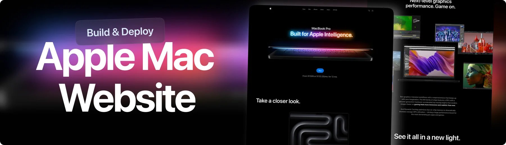

<div align="center">
  <br />
  
  <br />

  <div>
    
    
    
    
  </div>

  <h3 align="center">3D Apple Website</h3>
</div>

## 📋 <a name="table">Table of Contents</a>

1. ✨ [Introduction](#introduction)
2. ⚙️ [Tech Stack](#tech-stack)
3. 🔋 [Features](#features)
4. 🤸 [Quick Start](#quick-start)

## <a name="introduction">✨ Introduction</a>

Apple-inspired frontend experience built with React, Three.js, GSAP, and Tailwind CSS. It combines a scroll-driven 3D MacBook showcase on the homepage with a full product catalog, category landing pages, bag/checkout flow, and a mock Sign In / Create Account modal — all client-side with no real backend.

## <a name="tech-stack">⚙️ Tech Stack</a>

- **[React](https://react.dev/)** + **[Vite](https://vitejs.dev/)** — UI and fast local/production builds
- **[React Router](https://reactrouter.com/)** — multi-page navigation (Store, Mac, iPhone, iPad, Watch, Vision, AirPods, Support, Checkout, and more)
- **[Three.js](https://threejs.org/)** + **[React Three Fiber](https://docs.pmnd.rs/react-three-fiber)** + **[Drei](https://github.com/pmndrs/drei)** — interactive 3D product scene
- **[GSAP](https://gsap.com/)** — scroll timelines, pinned sections, and modal motion
- **[Tailwind CSS](https://tailwindcss.com/)** — layout and styling
- **[Zustand](https://zustand-demo.pmnd.rs/)** — bag, auth modal state, and shared UI state

## <a name="features">🔋 Features</a>

👉 **3D MacBook homepage** — scroll-synced model, lighting, and GSAP section timelines  

👉 **Product line landings** — Mac, iPhone, iPad, Watch, Vision, and AirPods with video heroes and shared product cards  

👉 **Store catalog** — filters, “The latest” spotlight, pagination, and product detail routes  

👉 **Navbar mega-menu** — desktop hover menus for Store and product lines  

👉 **Bag & checkout** — add to bag, review cart, and a frontend-only order confirmation  

👉 **Favourites & lists** — save products to multiple named lists (persisted locally), with heart controls on cards/detail and a dedicated `/favourites` page  

👉 **Auth modal** — Sign In, Create Account, Forgot Password (mock flows; show/hide password; OAuth buttons are placeholders)  

👉 **Responsive layout** — mobile nav, adaptive grids, and scroll-friendly sections  

## <a name="quick-start">🤸 Quick Start</a>

**Prerequisites**

- [Git](https://git-scm.com/)
- [Node.js](https://nodejs.org/en)
- [npm](https://www.npmjs.com/)

**Clone**

```bash
git clone https://github.com/vuyi-codes/3D-Apple-website.git
cd 3D-Apple-website
```

**Install**

```bash
npm install
```

**Run**

```bash
npm run dev
```

Open [http://localhost:5173](http://localhost:5173) in your browser.
